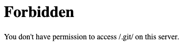
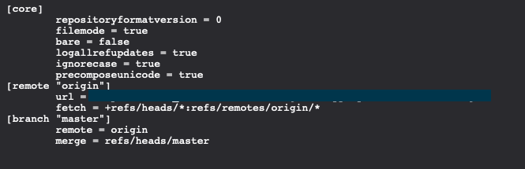
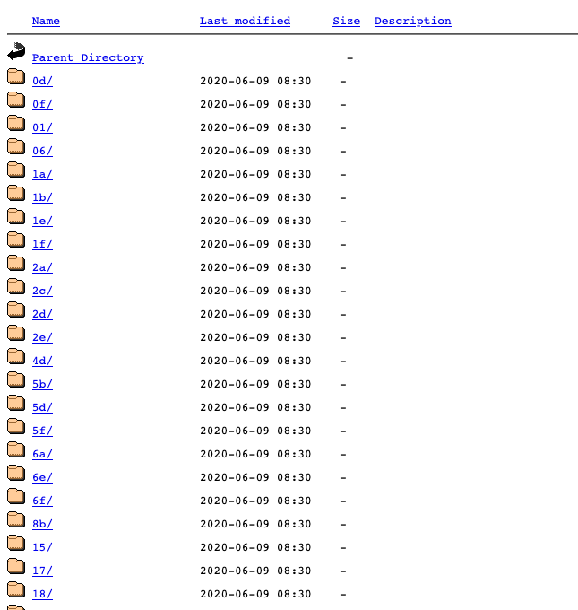
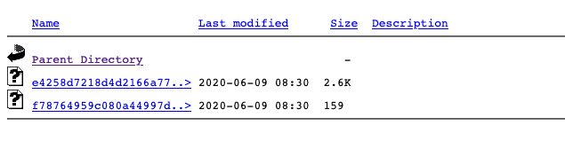

## Hacking a company and accessing the back-end files leading to RCE and a 4-digit bounty

Hello world. I was recently testing a web application and hoping to find some interesting issues. In this write-up, I will tell you about a public .git folder I found on that website, how I managed to use that .git folder to retrieve back-end files leading to RCE, and a 4-digit bounty.

If you are looking for some new research or approach, you may not find what you want in this write-up, since many people did the same before me. But if you want to learn about exploiting public .git folders, or you want to read some good write-up you're in the right place!

### Initial Reconnaissance
First and foremost, I enumerated the subdomains of the application. Later, I started examining the subdomains to see if anything is interesting. I crawled and fuzzed every single subdomain to find some significant paths. As I expected, I found interesting subdomains and paths. The most remarkable one was a .git folder, which originally returned 403 (I will tell you why this is not important.), and is the main topic of this write-up. 

### Forbidden or not?
`/.git` was returning 403, but what if I navigate to a file under the .git folder? After asking this question to myself, I navigated to `.git/config` and voila, I was able to view it! 

`/.git`:



`/.git/config`:



After realizing that I was able to view every single file under `.git`, I downloaded and parsed the `.git/index` file to see if there were any interesting filenames. I used https://github.com/sbp/gin to parse the git index. 

```
wget https://vulnerable.com/.git/index
gin index
```

Here are some of the paths that were in index.json:

```
admin.php
config.php
impersonateuser.php
phpunit.xml
composer.lock
```

### But how to read the files' contents? 

For those who do not know about git or git objects, I recommend googling it first. I will only tell what I did to read the files.

Let's try to read the admin.php file. If you look closer, you can see a sha1 hash above the filenames. We'll use it to download the object.

Let's assume that we have the sha1 hash `b7ccea095f22c12e1301c5515df2a8f1c5e35966` for a file we want to read. We should navigate to the directory `.git/objects/b7`. Here, `b` and `7` are the first two characters of our hash. And the object name is the rest of the hash, which is `ccea095f22c12e1301c5515df2a8f1c5e35966`. The URL should now look like the following: `https://vulnerable.com/.git/objects/b7/ccea095f22c12e1301c5515df2a8f1c5e35966`.






Now, all we have to do is downloading the object and decompressing it. I used python to decompress the file:

`wget https://vulnerable.com/.git/objects/b7/ccea095f22c12e1301c5515df2a8f1c5e35966`

```
>>> import zlib
>>> filename = 'ccea095f22c12e1301c5515df2a8f1c5e35966` 
>>> compressed_contents = open(filename, 'rb').read()
>>> decompressed_contents = zlib.decompress(compressed_contents)
>>> decompressed_contents
``` 

The python code is from [here](https://matthew-brett.github.io/curious-git/reading_git_objects.html).

Now we can read the file. I used this technique to read the file contents. If you think that this takes a lot of time and effort, you are right. [@rizasabuncu](https://twitter.com/rizasabuncu) developed [gigger](https://github.com/riza/gigger) (Git folder digger)  with Go. After manually installing and decompressing some of the objects, I used gigger and it did the rest of the work for me, thanks [@rizasabuncu](https://twitter.com/rizasabuncu). 


